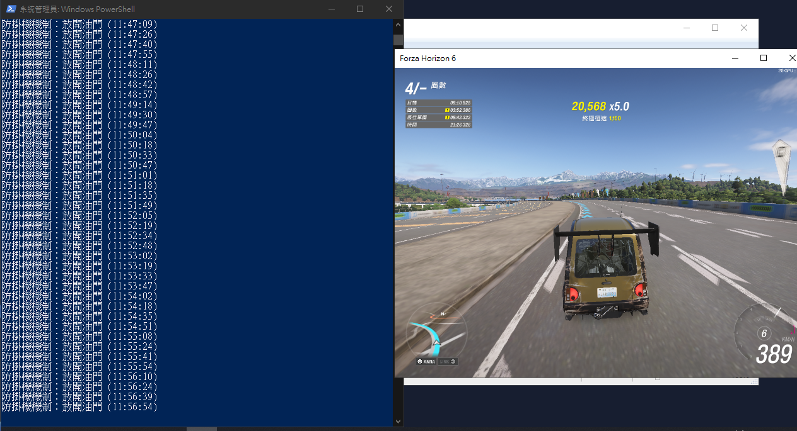

# Forza Horizon AFK Script

這是一款專為 Forza Horizon 系列開發的 Python 自動掛機輔助腳本。透過模擬虛擬 Xbox 控制器，提供高度穩定的自動油門控制，並內建起步防滑與防掛機偵測機制，確保長時間掛機的穩定性與安全性。
<br><br>

<br><br>
## 功能特色

* **自動油門控制**：精確模擬 Xbox 控制器右扳機 (RT) 訊號，穩定持續輸出。
* **起步防滑機制 (Soft Start)**：自訂起步初期的油門上限（例如前 60 秒限制 50% 油門），有效防止大馬力後驅或四驅車輛在起步瞬間因扭力過大而打滑失控。
* **防掛機偵測 (Anti-AFK)**：內建微隨機化的油門釋放機制，定時且短暫地放開油門，完美模擬真實玩家的操作動態，避免被遊戲系統判定為惡意掛機。
* **安全停止機制**：採用倒數計時啟動與直接關閉視窗停止的防呆設計，繞過遊戲對全域熱鍵的阻擋。

## 系統需求
* 作業系統：Windows 10 以後
* 執行環境：Python 3.x (安裝時請務必勾選「Add Python to PATH」)

## 環境準備 (手動安裝)

此腳本需要依賴外部 Python 套件：

* **vgamepad**：用於在 Windows 系統中生成一個虛擬的 Xbox 360 控制器，並向系統發送按鍵訊號。初次安裝與執行時，系統會自動安裝所需的 ViGEmBus 驅動程式。
* **keyboard**：用於設定全域熱鍵，讓你可以在遊戲全螢幕畫面中隨時啟動或停止掛機。（註：若您使用的是純倒數啟動版腳本，則只需安裝 vgamepad 即可）

請在終端機或命令提示字元 (cmd) 中執行以下指令進行安裝：

```bash
# 安裝腳本所需的依賴套件
pip install vgamepad keyboard
```

## 檔案結構

* `AFKgame.py`：掛機腳本核心程式。

## 安裝與使用教學

### 方法一：使用自動化腳本 (推薦)

1. 將 `AFKgame.py` 與 `RunAFK.ps1` 下載並放置於電腦上的同一個資料夾內。
2. 在 `RunAFK.ps1` 檔案上點擊滑鼠右鍵，選擇「用 PowerShell 執行」。
3. 若系統跳出使用者帳戶控制 (UAC) 提示，請選擇「是」以允許系統管理員權限。腳本將自動為您安裝所需套件並啟動程式。

### 方法二：手動執行

1. 完成上述「環境準備」的套件安裝。
2. 開啟以「系統管理員身分執行」的命令提示字元 (cmd)。
3. 輸入 `python 您的檔案路徑\AFKgame.py` 來啟動腳本。

### 執行後操作

1. **參數設定**：依照命令提示字元視窗中的提示，輸入您想要的掛機參數。若不想修改，可直接按下 Enter 鍵使用預設值。
2. **切換視窗**：參數設定完成後，程式會開始倒數 10 秒。請在此期間內使用滑鼠點擊並切換回 Forza Horizon 的遊戲畫面。
3. **停止掛機**：欲停止掛機時，請按下鍵盤的 `Alt + Tab` 切換回桌面，並直接將黑色的命令提示字元視窗關閉即可，程式會自動安全釋放所有虛擬按鍵。

## 參數設定說明

在執行腳本時，您可以針對以下項目進行微調：

* **正常行駛油門力道**：設定平時直線行駛時的油門深度 (預設 100%)。
* **起步防滑持續秒數**：設定起步時限制油門的時間 (預設 60 秒)。
* **起步防滑油門力道**：設定起步期間的最高油門深度 (預設 50%)。
* **放開油門間隔秒數**：防掛機機制的觸發頻率 (預設 15 秒)。
* **延遲啟動秒數**：設定完成後，切換回遊戲畫面的緩衝時間 (預設 10 秒)。

## 注意事項

* 請確保您的電腦已正確連線或配對真實的鍵盤與滑鼠，以免虛擬控制器驅動發生衝突。
* 遊戲必須處於最上層的作用中視窗，腳本才能正確在遊戲內生效。
* 部分防毒軟體可能會將虛擬控制器驅動程式誤判為風險項目，請設定為允許或加入白名單。

## 遊戲內難度與輔助設定建議

為了讓腳本發揮最大效用，達成真正的全自動掛機，建議直接將遊戲設定中的「駕駛輔助模式預設」調整為「所有輔助」。這樣系統才能在腳本控制油門的同時，自動處理轉向與煞車。

詳細的「難度設定」建議如下：

| 設定項目 | 建議選項 | 說明 |
| :--- | :--- | :--- |
| **剎車** | 輔助 | 讓遊戲系統在接近彎道時自動減速，避免衝出賽道。 |
| **轉向** | 自動轉向 | 極為重要。讓車輛能夠自動沿著最佳路線轉彎。 |
| **循跡控制系統** | 開啟 | 減少車輪打滑，維持出彎穩定性。雖然關閉此選項會有 CR 獎勵加成，但掛機為求穩定必須開啟。 |
| **穩定控制系統** | 開啟 | 防止車輛在高速或過彎時失控打轉。同樣關閉有加成，但掛機時必須開啟。 |
| **排檔系統** | 自排 | 讓電腦自動負責升降檔。 |
| **行駛路線** | 完整 | 確保自動轉向與自動剎車系統能正確辨識路線與煞車時機。 |
| **損壞與輪胎損耗** | 外觀 | 避免長時間進行長途賽事（如歌利亞環道）導致車輛性能下降而無法完賽。 |
| **倒轉** | 關閉 | 掛機時不會用到此功能，且更改此選項 **並不會** 影響 CR 獎勵加成。 |
| **起跑控制** | 開啟 | 進一步輔助起步時的穩定度。 |

### 賽事選擇與車輛調校建議

* **賽事選擇**：建議選擇沒有碰撞干擾的「單圈長途賽事」或玩家自製的「高圈數掛機藍圖」，例如著名的歌利亞環道 (The Goliath)。
* **車輛調校**：雖然腳本已內建起步防滑機制，但仍建議為掛機車輛換上抓地力較高的輪胎，並將下壓力調高，以提升高速過彎時的穩定性，降低意外衝出賽道的機率。


